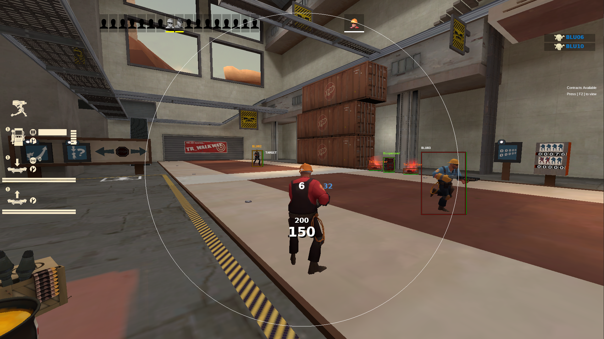
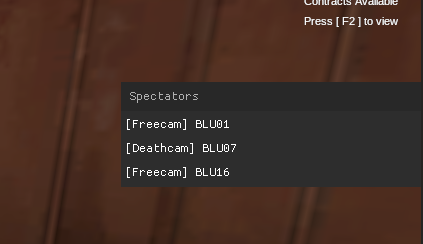
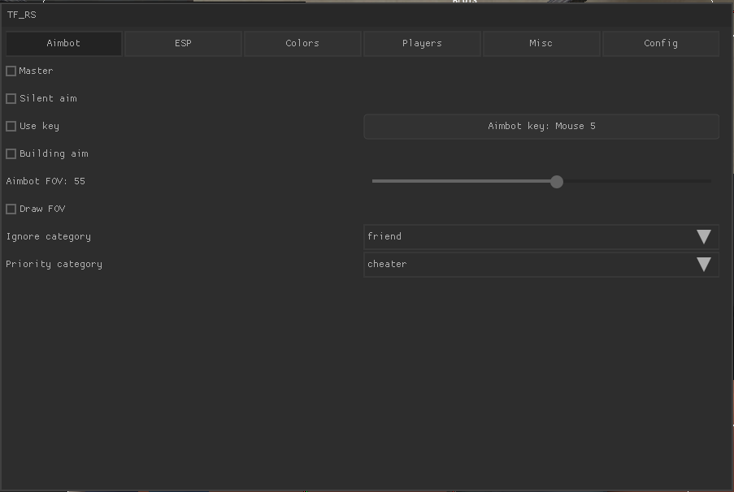
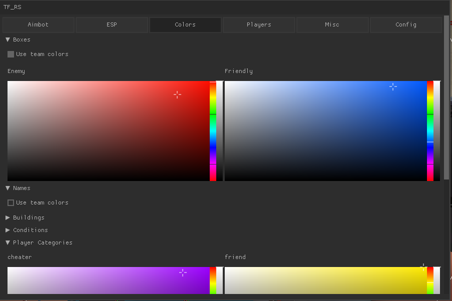
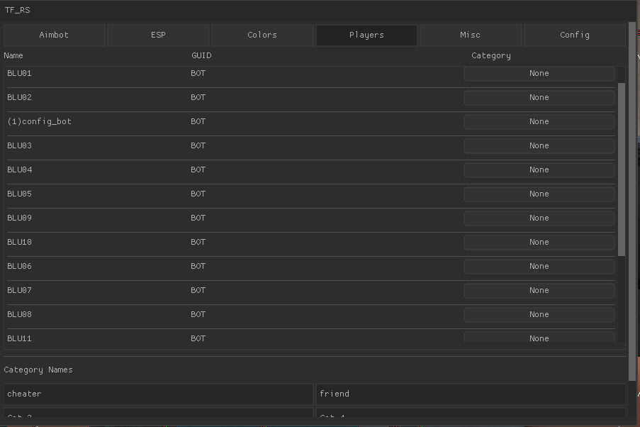

# tf_rs

A Team Fortress 2 game cheat written in Rust for Linux, intended as an educational reference for understanding shared library injection, vtable hooking, and Source engine internals.

> **Note:** This project targets the Linux version of TF2 and is intended for use on private servers, in single-player, or in other contexts where you have authorization to modify the game client. Use responsibly.

This project is a port and evolution of [tf_c](https://github.com/faluthe/tf_c), an earlier C implementation of the same concepts. The rewrite in Rust adds type safety, a richer config system, and a more structured codebase — while covering the same underlying techniques. Both projects use [Nuklear](https://github.com/Immediate-Mode-UI/Nuklear) for the in-game GUI, but tf_rs wraps it in an idiomatic Rust API with builder-style chaining rather than calling the C bindings directly.

---

## Table of Contents

1. [Overview](#overview)
2. [Project Structure](#project-structure)
3. [How It Works — High Level](#how-it-works--high-level)
4. [Injection](#injection)
5. [Library Initialization & Cleanup](#library-initialization--cleanup)
6. [Source Engine Interface Resolution](#source-engine-interface-resolution)
7. [Hooking](#hooking)
   - [VTable Hooking](#vtable-hooking)
   - [SDL Hooking](#sdl-hooking)
8. [Memory Reading Patterns](#memory-reading-patterns)
9. [Features](#features)
   - [Aimbot](#aimbot)
   - [ESP (Extra Sensory Perception)](#esp-extra-sensory-perception)
   - [Bunnyhop](#bunnyhop)
   - [Thirdperson Toggle](#thirdperson-toggle)
   - [Spectator List](#spectator-list)
   - [In-Game Menu](#in-game-menu)
   - [Player Database](#player-database)
   - [Config System](#config-system)
10. [The Nuklear UI Layer](#the-nuklear-ui-layer)
11. [Building & Running](#building--running)
12. [Dependencies](#dependencies)

---

## Overview

`tf_rs` is a shared library (`.so`) that is injected into a running TF2 process on Linux. Once loaded, it:

- Resolves Source engine interfaces from already-loaded shared libraries
- Hooks key engine functions to intercept game logic and rendering
- Draws an in-game overlay and menu using the [Nuklear](https://github.com/Immediate-Mode-UI/Nuklear) immediate-mode GUI library rendered into a second OpenGL context
- Provides aimbot, ESP, movement assistance, and player tracking features

The codebase demonstrates several low-level techniques that are useful for understanding game internals, reverse engineering, and unsafe Rust:

- ELF `.init_array` / `.fini_array` for constructor/destructor execution on `dlopen`/`dlclose`
- Source engine `CreateInterface` factory pattern
- VTable hooking via `mprotect` + direct memory writes (see the [VTable Hooking guide](https://github.com/faluthe/vtable-hook))
- SDL2 function pointer hooking through JMP stub resolution
- RIP-relative address calculation for finding non-exported globals
- Raw pointer casting and offset-based struct field access in Rust

---

## Project Structure

```
tf_rs/                      ← Workspace root
├── tf_rs/                  ← Main cdylib (the injected .so)
│   ├── src/
│   │   ├── lib.rs          ← Entry point: .init_array / .fini_array
│   │   ├── config/         ← Persistent config with custom serialization
│   │   ├── features/
│   │   │   ├── aimbot.rs   ← Target selection & aim angle calculation
│   │   │   ├── esp.rs      ← On-screen overlay drawing
│   │   │   ├── menu.rs     ← Nuklear in-game menu
│   │   │   ├── movement.rs ← Bunnyhop
│   │   │   └── spectator_list.rs
│   │   ├── globals/        ← Shared runtime state (RwLock)
│   │   ├── helpers/        ← Math utilities + helper macros
│   │   ├── hooks/
│   │   │   ├── core.rs     ← Hook registration and global hook state
│   │   │   ├── create_move.rs   ← Hook: game input frame
│   │   │   ├── paint_traverse.rs ← Hook: per-panel render pass
│   │   │   ├── poll_event.rs    ← Hook: SDL event polling
│   │   │   ├── swap_window.rs   ← Hook: SDL frame swap (menu/overlay)
│   │   │   ├── vtablehook.rs    ← VTable hook implementation
│   │   │   ├── sdlhook.rs       ← SDL function pointer hook
│   │   │   └── fn_sig.rs        ← Type-safe function signature wrapper
│   │   ├── interfaces/     ← Source engine interface wrappers
│   │   ├── player_db.rs    ← Per-GUID player category database
│   │   ├── traits/         ← FromRaw trait for pointer casting
│   │   └── types/          ← Entity, Player, Weapon, Vec3, etc.
│   └── build.rs            ← Links SDL2 + GLEW
├── inject/                 ← Injector binary
│   ├── src/main.rs         ← Builds tf_rs, finds PID, calls inject script
│   └── so_inject.sh        ← GDB-based dlopen injector
├── nuklear/                ← Safe Rust wrapper around nuklear_sys
└── nuklear_sys/            ← bindgen FFI bindings + C implementation
```

---

## How It Works — High Level

```
┌─────────────────────────────────────────────────────────────┐
│  cargo inject                                               │
│    → builds tf_rs.so                                        │
│    → finds tf_linux64 PID via pidof                         │
│    → calls so_inject.sh inject <PID> <path/to/tf_rs.so>    │
└───────────────────────┬─────────────────────────────────────┘
                        │ GDB attaches, calls dlopen()
                        ▼
┌─────────────────────────────────────────────────────────────┐
│  ELF .init_array fires → init() runs                        │
│    → Interfaces::init()   (resolve engine interfaces)       │
│    → player_db::load()    (load saved player categories)    │
│    → Hooks::init()        (install hooks)                   │
└───────────────────────┬─────────────────────────────────────┘
                        │ Game continues running
                        ▼
┌─────────────────────────────────────────────────────────────┐
│  Per-frame hooks fire:                                      │
│    CreateMove    → aimbot, bunnyhop, thirdperson            │
│    PaintTraverse → ESP overlay                              │
│    SDL_PollEvent → input capture for menu/keybinds          │
│    SDL_GL_SwapWindow → Nuklear menu + spectator list        │
└─────────────────────────────────────────────────────────────┘
```

---

## Injection

Injection uses `gdb` to attach to the running game process and call `dlopen()` on the compiled `.so`. The injector (`inject/`) automates this:

1. `cargo build -p tf_rs` to produce the `.so`
2. `pidof tf_linux64` to find the game PID
3. `sudo gdb -p <PID> -batch -ex "call dlopen(\"<path>\", 1)"` to inject

`so_inject.sh` also supports `uninject` using `dlclose` with the handle returned by `dlopen`. The debug mode (`--debug`) additionally opens two `gnome-terminal` windows tailing the game's stdout/stderr file descriptors via `/proc/<pid>/fd/1` and `/proc/<pid>/fd/2`, so you can see `log::` output live.

```bash
cargo inject           # build (debug) + inject
cargo inject --release # build (release) + inject
cargo inject --debug   # build + inject + open debug terminals
```

---

## Library Initialization & Cleanup

Rather than spawning a thread from `DllMain` (the Windows approach), on Linux we use ELF constructor/destructor arrays. In `lib.rs`:

```rust
#[used]
#[unsafe(link_section = ".init_array")]
static INIT: extern "C" fn() = { extern "C" fn init() { /* ... */ } init };

#[used]
#[unsafe(link_section = ".fini_array")]
static FINI: extern "C" fn() = { extern "C" fn fini() { /* ... */ } fini };
```

- `.init_array` — the dynamic linker calls function pointers in this section immediately after `dlopen` maps and relocates the library. This is where interfaces are resolved and hooks are installed.
- `.fini_array` — called on `dlclose`. Used to restore original function pointers before the library is unloaded.
- `#[used]` prevents the compiler from dead-stripping the statics even though nothing in Rust references them directly.

---

## Source Engine Interface Resolution

The Source engine exposes its subsystems through a `CreateInterface` factory function exported from each shared library. Each library (`client.so`, `engine.so`, `vgui2.so`, `vguimatsurface.so`) exports this symbol, and you call it with a version string like `"VEngineClient014"` to get back an opaque `*mut c_void` pointing to a vtable-based object.

### `Factory` (`interfaces/factory.rs`)

```
dlopen(lib path, RTLD_NOLOAD | RTLD_NOW)  ← get handle to already-loaded lib
dlsym(handle, "CreateInterface")           ← get factory fn pointer
factory("VEngineClient014", null)          ← get interface pointer
```

`RTLD_NOLOAD` is important — it gets a handle to the library without loading it again (it's already in the game's address space).

Interfaces loaded at startup:

| Version String              | Library                | What it gives you                    |
|-----------------------------|------------------------|--------------------------------------|
| `VClient017`                | `client.so`            | Base client interface                |
| `VEngineClient014`          | `engine.so`            | Engine: screen size, player info, in-game check |
| `VClientEntityList003`      | `client.so`            | Entity list access                   |
| `VGUI_Panel009`             | `vgui2.so`             | Panel names (for PaintTraverse hook) |
| `VGUI_Surface030`           | `vguimatsurface.so`    | Drawing primitives (lines, text, rects) |
| `VDebugOverlay003`          | `engine.so`            | World-to-screen projection           |
| `EngineTraceClient003`      | `engine.so`            | Ray tracing (visibility checks)      |

### Finding Non-Exported Globals

Some interfaces (like `g_pClientMode` and `g_pGlobals`) are not exported — they're internal globals. To find them, the code reads the compiled machine code of a known exported virtual function, extracts the RIP-relative effective address embedded in the instruction, and dereferences it:

```rust
// In HudProcessInput (vtable index 10 on VClient017):
// The function body is just: call [rip + offset_to_g_pClientMode]
let hud_process_input = *(before_add.add(10)) as usize;
let eaddr = ptr::read_unaligned((hud_process_input + 0x3) as *const u32);
let ip = hud_process_input + 0x7;  // next instruction address
let client_mode = ptr::read_unaligned((ip + eaddr as usize) as *const *mut c_void);
```

This technique (reading effective addresses from compiled instructions) works as long as the binary doesn't change. It's a common pattern in Source engine cheats.

---

## Hooking

### VTable Hooking

> For a thorough walkthrough of this technique, see the [VTable Hooking guide](https://github.com/faluthe/vtable-hook).

Source engine objects (like `IClientMode` and `IPanel`) are C++ classes with vtables. A vtable is an array of function pointers stored in read-only memory. To hook a virtual function:

1. Get the vtable pointer from the object (`*(obj as *mut *mut *mut c_void)`)
2. Make the vtable page writable with `mprotect(..., PROT_READ | PROT_WRITE)`
3. Save the original function pointer at the target index
4. Write your hook function pointer at that index
5. Restore the page to read-only with `mprotect(..., PROT_READ)`

**`VTableHook` (`hooks/vtablehook.rs`):**

```
object ptr → vtable ptr → [fn0, fn1, ..., fnN, ...]
                                             ↑
                              overwrite this slot
```

Hooks installed:
- `IClientMode` vtable index 22 → `CreateMove` (runs every input frame; used for aimbot, bunnyhop, thirdperson)
- `IPanel` vtable index 42 → `PaintTraverse` (runs for each UI panel; used for ESP overlay)

### SDL Hooking

SDL2 on Linux exports symbols through a JMP stub — the exported symbol is just a short jump to the real function pointer stored in writable memory. This lets SDL be updated without relinking consumers. The hook resolves through the stub to patch the underlying pointer directly:

```
SDL_PollEvent (exported symbol):
  jmp [rip + 4]   ← 2-byte opcode
  <4-byte offset>  ← signed offset relative to next instruction
  ↓
  *ptr_to_actual_fn  ← this is what we patch
```

```rust
let offset = ptr::read_unaligned((func as usize + 2) as *const i32);
let ptr_to_func = (func as usize + 6 + offset as usize) as *mut *mut c_void;
self.original = FnSig::from_ptr(*ptr_to_func, hook);
ptr::write(ptr_to_func, hook.as_ptr()?);
```

Hooks installed:
- `SDL_PollEvent` → `hk_poll_event` (captures keyboard/mouse input for the menu and keybinds)
- `SDL_GL_SwapWindow` → `hk_swap_window` (runs at end of each frame; used to render Nuklear menu and spectator list)

---

## Memory Reading Patterns

Two macros make reading game memory ergonomic:

### `vfunc!` — Virtual Function Dispatch

Reads a function pointer from a vtable at a given index and transmutes it to the provided signature:

```rust
// Call virtual function at index 152: GetHealth() -> i32
let f = vfunc!(self.vtable, 152, extern "C" fn(*mut c_void) -> i32);
let health = f(self.this);
```

### `offset_get!` — Memory Offset Field Access

Generates an accessor method that reads a value at a fixed byte offset from `self.this`:

```rust
offset_get!(pub fn team: Team, 0xDC);
// expands to:
pub fn team(&self) -> Team {
    unsafe { core::ptr::read((self.this as *const u8).add(0xDC) as *const Team) }
}
```

These offsets are found via reverse engineering (static analysis in IDA/Ghidra, or open-source TF2 SDK references like the Valve leak).

---

## Features

### Aimbot

**File:** `features/aimbot.rs` | **Hook:** `CreateMove`

The aimbot selects the best target in the entity list and modifies the player's `view_angles` in the `UserCmd` before it is sent to the server.

**Target selection:**
1. Iterate all entities in the entity list
2. Skip: dormant, dead, same team, self
3. For players: optionally aim for the head bone if `health > 50` and the weapon supports headshots; otherwise aim for the torso (bone 1)
4. For buildings (Sentry, Dispenser, Teleporter): aim for the center of the AABB
5. Calculate the aim angle to the target using `atan2` on the 3D delta vector
6. Calculate the FOV from the current view angle to the target angle
7. Reject targets outside the configured FOV cone
8. Reject targets that fail a visibility ray trace
9. Keep the closest-FOV target; priority category targets always beat normal targets

**Headshot logic:**
- Each player class has a different head bone ID (Engineer = 8, Demoman = 16, Sniper/Soldier = 5, others = 6)
- Headshots are suppressed if weapon spread > 0 (e.g., shotguns mid-spray)

**Silent aim:**
- When enabled, `hk_create_move` returns `0` instead of the real return value, which tells the engine not to use the modified angles for the local player's view — so the crosshair appears still while shots land on target

**Key binding:**
- Can be set to fire on attack button press, or to a dedicated held key (keyboard scancode or mouse button)
- Key capture uses an "editing mode" where the next input is recorded as the bind

**Category filters:**
- **Ignore category**: skip players tagged with this category entirely
- **Priority category**: always prefer players tagged with this category over untagged ones



---

### ESP (Extra Sensory Perception)

**File:** `features/esp.rs` | **Hook:** `PaintTraverse`

ESP runs inside `PaintTraverse` when the panel is `"FocusOverlayPanel"` — a top-level panel that renders over the entire screen. It uses the VGUI Surface interface to draw directly.

**Per-entity each frame:**
- Get a screen-space bounding box by projecting all 8 corners of the entity's AABB through `DebugOverlay::ScreenPosition` and taking the min/max of the resulting 2D points
- Draw a 3-layer box: black outer border, colored middle, black inner border (for visibility against any background)
- Draw the player name above the box
- Draw a health bar: vertical bar on the right side for players, horizontal bar below for buildings. Color interpolates from green (full) through yellow to red (low)

**Condition labels:**
Labels shown to the right of the box for special player states:

| Label       | Meaning                                                      |
|-------------|--------------------------------------------------------------|
| `DISGUISED` | Spy is disguised                                             |
| `TAUNTING`  | Player is taunting (vulnerable)                              |
| `ZOOMED`    | Sniper is scoped in                                          |
| `INVISIBLE` | Spy is at >90% cloak (suppressed by Burning/Milk/Urine)     |
| `MILKED`    | Player has Mad Milk applied                                  |
| `NO MG`     | Enemy Soldier has >195 HP (likely has Escape Plan / Banner) |
| `BUTTER`    | Enemy Soldier has ≤65 HP (easy market garden target)         |
| `<category>`| Player is in a named custom category                         |

**Color system:**
- Can use TF2 team colors (RED team = red, BLU team = blue) or custom solid colors per faction
- Aimbot target overrides to orange
- Players in a custom category override to the category's color

**FOV circle:**
- When aimbot is enabled and Draw FOV is checked, a circle is drawn at the screen center showing the aimbot's field of view radius

---

### Bunnyhop

**File:** `features/movement.rs` | **Hook:** `CreateMove`

Automates bunnyhopping by detecting when the player is airborne and removing the jump button from the `UserCmd` before it is processed. This prevents the momentary frame of ground contact from resetting velocity.

```
if !on_ground && was_jumping:
    strip InJump from cmd.buttons
```

---

### Thirdperson Toggle

**Hook:** `CreateMove` + `SDL_PollEvent`

Sets a flag at memory offset `0x240C` on the local player to switch the camera to third-person. Bound to a configurable key; pressing it toggles between first-person and third-person.

---

### Spectator List

**File:** `features/spectator_list.rs` | **Hook:** `SDL_GL_SwapWindow`

Shows a Nuklear window in the top-right corner listing all players currently spectating you (or your observer target if you're dead). Each entry shows the observer mode:

| Mode          | Color  | Description                        |
|---------------|--------|------------------------------------|
| Firstperson   | Red    | Direct first-person spectate       |
| Thirdperson   | White  | Chase cam                          |
| Freecam       | White  | Free-roaming camera                |
| Roaming       | White  | Free-roaming (death cam variant)   |
| Deathcam      | White  | Brief post-death cam               |
| Fixed         | White  | Fixed camera position              |



---

### In-Game Menu

**File:** `features/menu.rs` | **Hook:** `SDL_GL_SwapWindow`

A Nuklear immediate-mode GUI rendered into a second OpenGL context. Toggle visibility with the `Delete` key. The menu is a movable, bordered window with six tabs:

#### Aimbot Tab

- Master enable checkbox
- Silent aim toggle
- Use key / key binding capture
- Building aim toggle
- FOV slider (1–100 degrees)
- Draw FOV toggle
- Ignore category dropdown
- Priority category dropdown

#### ESP Tab

- Master enable checkbox
- Per-faction entity ESP combos (enemy/friendly players, enemy/friendly buildings):
  - Boxes, Names, Health bar
- Conditions multi-select combo
- Aimbot target highlight toggle

#### Colors Tab

Tree-collapsed color pickers for:
- Box colors (enemy/friendly or team colors toggle)
- Name colors (enemy/friendly or team colors toggle)
- Building colors per type (Sentry, Dispenser, Teleporter)
- Condition label colors
- Player category colors (2×2 grid of 4 categories)

#### Players Tab

A scrollable table of all players currently in the server showing:
- Name
- GUID (Steam network ID)
- Category (click to cycle through None → Cat1 → Cat2 → Cat3 → Cat4 → None)

Category name fields and a "Save Names" button to rename the four categories.

#### Misc Tab

- Bunnyhop toggle
- Spectator list toggle
- Thirdperson key binding

#### Config Tab

- Scrollable list of saved configs (selectable; clicking loads it)
- Save button (shown for selected config)
- Refresh button
- New config name field + Create button

<!-- Screenshot: Full menu open showing the Aimbot tab -->


<!-- Screenshot: Colors tab with color pickers open -->


<!-- Screenshot: Players tab showing player list with category buttons -->


---

### Player Database

**File:** `player_db.rs`

Players are identified by their GUID (a Steam network identifier returned by `GetPlayerInfo`). Each player can be assigned to one of four user-defined categories, which affects ESP color and aimbot behavior.

**Persistence format** (`~/.tf_rs_players.cfg`):
```
#cat1=Friendlies
#cat2=Enemies
#cat3=Regulars
#cat4=
STEAM_0:0:12345678|Cat 1
STEAM_0:1:87654321|Cat 2
```

Header lines (`#catN=name`) store custom category names. Body lines are `GUID|CategoryName` pairs. The file is read on load and written atomically on every change.

---

### Config System

**File:** `config/mod.rs`

All feature settings are stored in a `Config` struct and persisted to `~/.{name}.tf_rs.cfg`. Configs are plain-text key-value files:

```
bunnyhop: false
esp:
    master: true
    player_enemy:
        boxes: true
        names: true
        health: true
aimbot:
    master: false
    fov: 15
    ...
```

#### `struct_with_serialize!` Macro

Rather than pulling in `serde`, the config uses a custom proc macro that derives:
- `Display` — recursive indented serialization to a text format
- `FromStr` — recursive parser that handles both inline (`key: value`) and block (`key:\n    subkey: value`) forms

This allows nested structs (like `ESP → player_enemy → boxes`) to round-trip through a human-readable file format without external dependencies.

The macro iterates struct fields at compile time and generates match arms for both serialization directions, supporting arbitrary nesting depth by delegating to inner types' own `Display` / `FromStr` impls.

---

## The Nuklear UI Layer

The menu renders into a **separate OpenGL context** created alongside the game's existing context. This avoids corrupting the game's GL state.

**Context management (`nuklear/src/context.rs`):**
- On first call to `SDL_GL_SwapWindow`, a new GL context is created and shared with the game's context
- Each frame: `SDL_GL_MakeCurrent(window, new_ctx)` → render Nuklear → `SDL_GL_MakeCurrent(window, og_ctx)` → let the game swap

**Input handling:**
- `SDL_PollEvent` is hooked to feed events into Nuklear before the game sees them
- When the menu is open, events that Nuklear consumes are nulled out (`event.type_ = 0`) so the game ignores them
- The `is_draw_key_released` check for `Delete` toggles `DO_DRAW` (a static bool) and shows/hides the OS cursor via `Surface::SetCursorVisible`

**Rust wrapper (`nuklear/`):**
The `nuklear` crate provides a safe Rust API over the raw C bindings in `nuklear_sys`. It wraps the Nuklear C library (included as a git submodule) compiled via `bindgen`. The wrapper exposes builder-style chaining:

```rust
nk.row_dynamic(30.0, 2)
  .label("FOV", TextAlignment::LEFT)
  .slider_int(1, &mut config.aimbot.fov, 100, 1);
```

---

## Building & Running

### Prerequisites

```bash
# Required packages (Ubuntu/Debian)
sudo apt install libsdl2-dev clang gdb libglew-dev
```

> **Important:** GLEW 2.1 is required. GLEW 2.2 does not work due to Steam Runtime library compatibility issues. On some distros you may need to install from source or use the Steam Runtime's GLEW.

### Cargo aliases

The `.cargo/config.toml` defines a `cargo inject` alias. To run:

```bash
# Build (debug) and inject
cargo inject

# Build (release) and inject
cargo inject --release

# Build, inject, and open debug terminal windows (requires gnome-terminal)
cargo inject --debug
```

The injector finds the running TF2 process by name (`tf_linux64`), builds the library, then calls `sudo gdb` to inject it. Root is required because `gdb` needs `ptrace` permission on the game process.

### Manual injection

```bash
# Build the library
cargo build -p tf_rs

# Find the PID
pidof tf_linux64

# Inject
sudo ./inject/so_inject.sh inject <PID> ./target/debug/libtf_rs.so

# Uninject (using the handle printed by dlopen)
sudo ./inject/so_inject.sh uninject <PID> <handle_address>
```

---

## Dependencies

| Crate / Library  | Purpose                                                         |
|------------------|-----------------------------------------------------------------|
| `anyhow`         | Ergonomic error handling throughout                             |
| `log` / `env_logger` | Structured logging, visible via `/proc/<pid>/fd/2`          |
| `libc`           | `dlopen`, `dlsym`, `mprotect`, `sysconf`, etc.                 |
| `once_cell`      | `Lazy<T>` for deferred static initialization                    |
| `nuklear`        | Local crate — safe Rust wrapper around Nuklear immediate GUI    |
| `nuklear_sys`    | Local crate — `bindgen`-generated C FFI for Nuklear + SDL2 bits |
| SDL2             | Game uses SDL2; we hook its `PollEvent` and `SwapWindow`        |
| GLEW 2.1         | OpenGL extension loading for the Nuklear render context          |
| GDB              | Used by the injector to call `dlopen` in the game process       |
